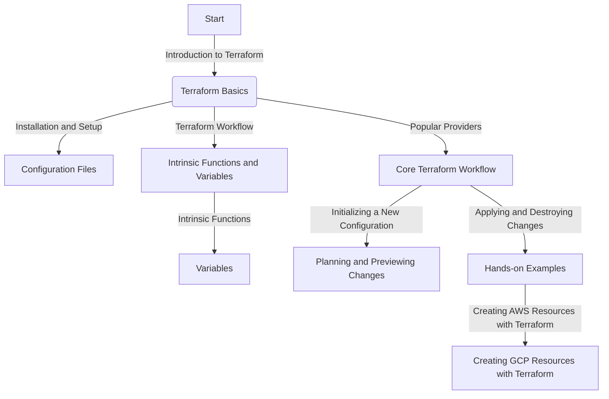

## Terraform Primer

- Two-hour workshop for HashiCorp Terraform with a structured approach to cover the basics of Terraform, intrinsic functions like count, the use of variables, and the power of popular providers such as AWS and GCP. Below is a detailed outline and sample how-to for the core Terraform workflow and creation/destruction of resources, along with documentation in markdown format and a flow chart in mermaid for the course outline and material.


<details><summary>Click to expand the outline
</summary>

## Course Detailed Outline: Introduction to Terraform

- Terraform is an open-source infrastructure as code software tool created by HashiCorp. It allows users to define and provision a data center infrastructure using a high-level configuration language. Terraform manages external resources such as physical machines, virtual machines, containers, and more. It is a declarative language, which means you describe the end state that you want, and Terraform will figure out how to achieve that state. 

### Terraform Basics: Installation and Setup

- To install Terraform, download the appropriate package for your operating system from the Terraform website. Use these commands: 
  

```bash
curl -O https://releases.hashicorp.com/terraform/1.3.5/terraform_1.3.5_linux_amd64.zip
```

```bash
unzip terraform_1.3.5_linux_amd64.zip 
```

```bash 
sudo mv terraform /usr/local/bin/
```

View the installed version: 
`terraform --version`

- After downloading, unzip the package and move the terraform binary to a directory included in your system's PATH.
- Configuration Files
Terraform uses configuration files to describe the components needed to run a single application or your entire datacenter. The format of the configuration files is JSON or HashiCorp Configuration Language (HCL). An example of a simple Terraform configuration file is shown below:

```hcl
provider "aws" {
  region = "us-west-2"
}

resource "aws_instance" "example" {
  ami           = "ami-0c55b159cbfafe1f0"
  instance_type = "t2.micro"
}
```

## Terraform Workflow

  *The Terraform workflow consists of the following steps:*
- **Initialize**: Run `terraform init` to initialize a working directory containing Terraform configuration files and instantiate the terraform provider.  
- **Plan**: run `terraform plan` to create an execution plan.
- **Apply**: run `terraform apply` to apply the changes required to reach the desired state of the configuration. Save the declarative output file `terraform apply -o tf.out``

## Intrinsic Functions and Variables

- **Intrinsic Functions**: Terraform has a number of intrinsic functions that allow you to perform various operations within your Terraform configurations. One of the most commonly used intrinsic functions is count, which allows you to create multiple instances of a resource.

- **Variables**: Variables in Terraform allow you to parameterize your configurations, making them more flexible and reusable. You can declare variables using the variable block and assign them values using a variables.tf file. These will look like this
  
```hcl
variable userid {
  description = "Userid"
  type = string
}
```

- The variable will be referenced in a configuration as the following resource block using `var.userid`
  
```hcl 
resource "aws_iam_user" "demouser" {
    name = var.userid
} 
```
  
## Popular Providers

- Terraform supports a wide variety of providers, which are responsible for understanding API interactions and exposing resources. Two of the most popular providers are AWS and GCP.

## Core Terraform Workflow
Initializing a New Configuration
To initialize a new Terraform configuration, navigate to the directory containing your configuration files and run terraform init.

## Planning and Previewing Changes

- To create an execution plan, run terraform plan. This will show you what Terraform will do before actually doing it.
## Applying and Destroying Changes

- To apply the changes required to reach the desired state of the configuration, run terraform apply. To destroy the Terraform-managed infrastructure, run terraform destroy.

## Hands-on Examples

- Creating AWS Resources with Terraform
- To create AWS resources with Terraform, you need to configure the AWS provider and define the resources you want to create. An example of creating an AWS S3 bucket is shown below:

## Mermaid Flow for the Course



## Extras

- Automated documentation of deployments: It is possible to generate documentation for Terraform in markdown format using the terraform-docs tool. This tool allows you to automatically generate documentation for your Terraform modules, including inputs, outputs, and other relevant information, in markdown format. You can install the terraform-docs tool as a standalone binary and use it to generate markdown documentation for your Terraform code. The generated markdown documentation can be exported to Git for easy sharing and collaboration. The tool supports various output formats, but markdown is particularly useful for exporting to Git.


-  Use the command line to gen docs  `terraform-docs markdown --indent 3 . >docs.md ` 